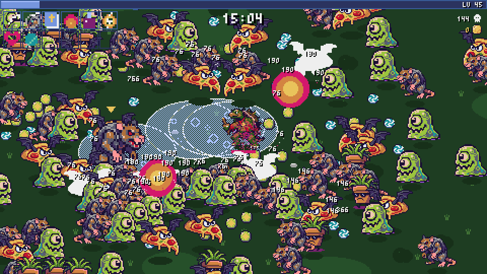
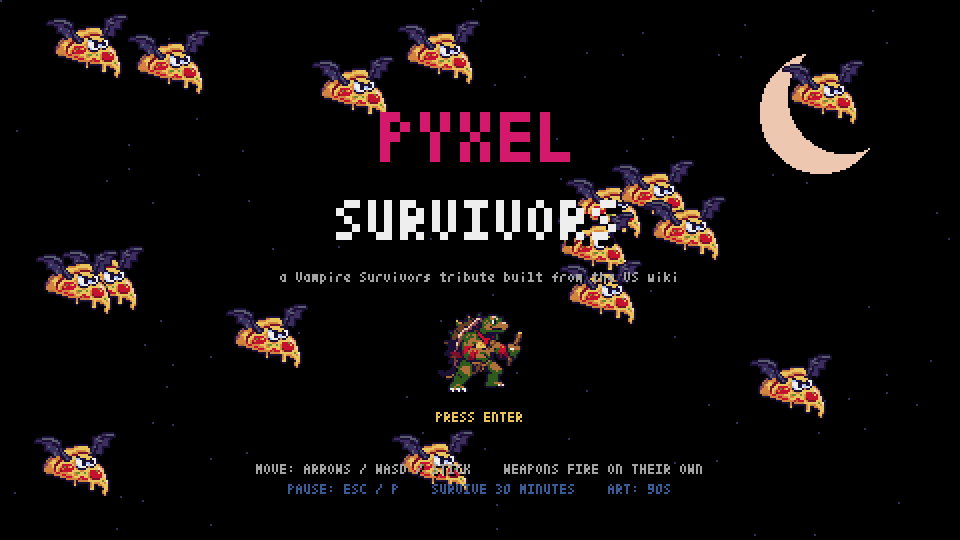
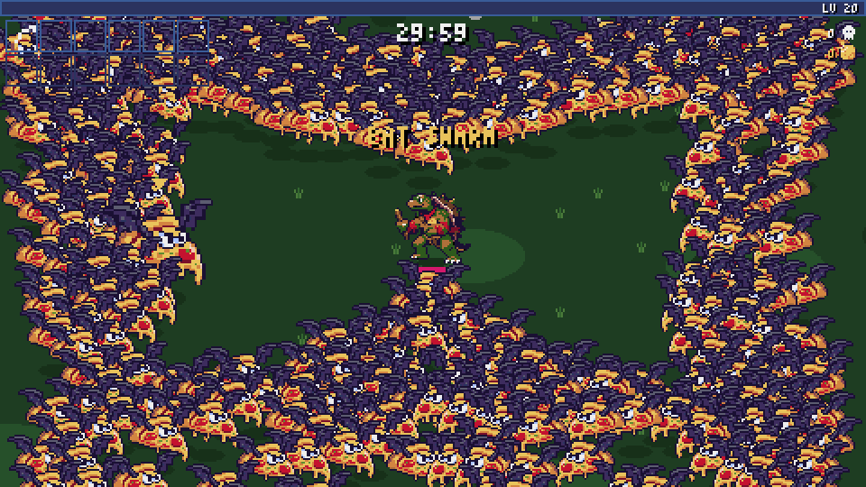
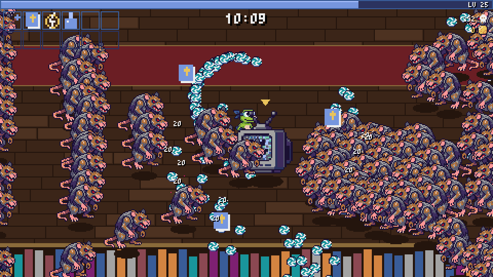
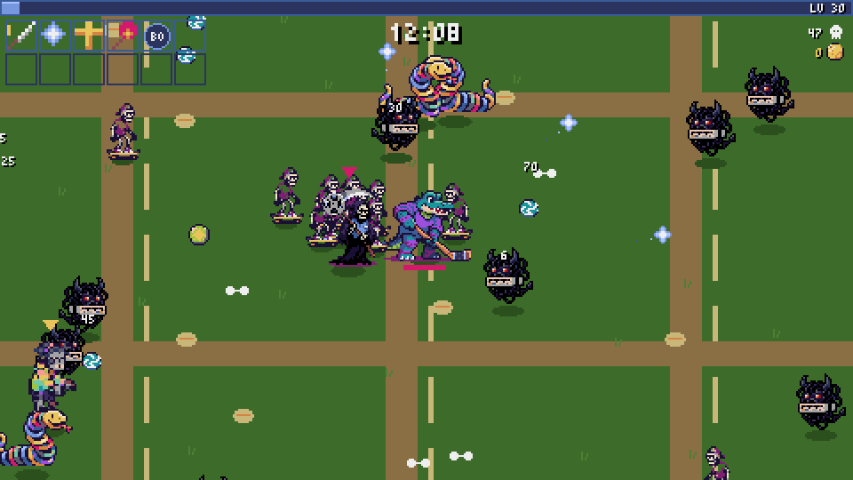
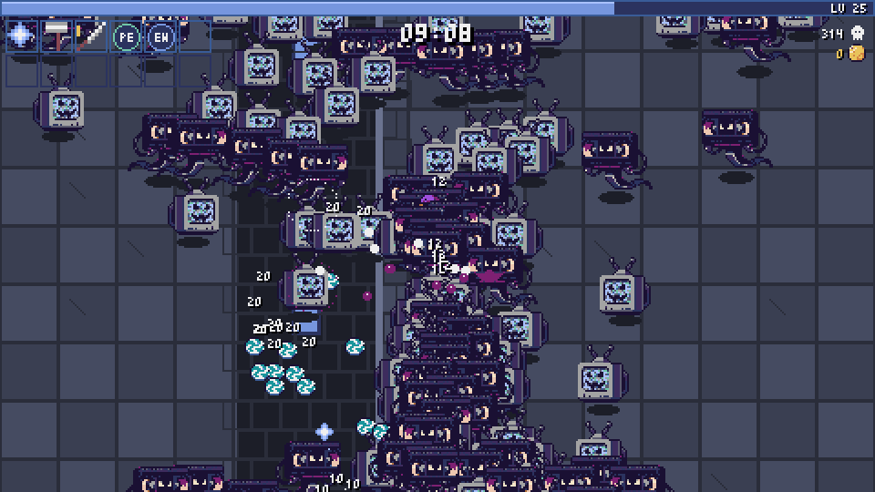
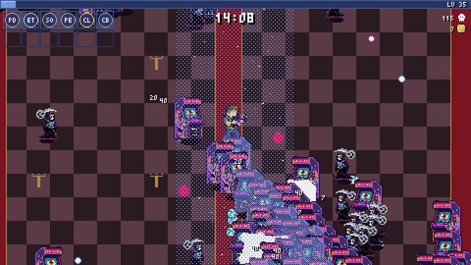
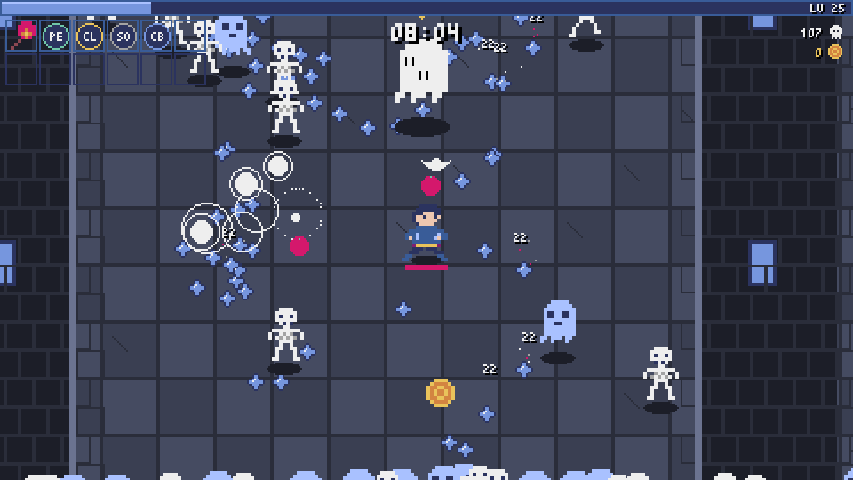

<div align="center">

# Pyxel Survivors

**A Vampire Survivors tribute in pure Python, with 90s Saturday-morning style.**

Five stages, fifty weapons, twenty-two Arcanas, hundreds of monsters on screen, and one
very persistent video-store Reaper. The whole thing is built on [Pyxel](https://github.com/kitao/pyxel)
and driven by real game data.

[](https://www.python.org/)
[](https://github.com/kitao/pyxel)
[](https://docs.astral.sh/uv/)
[](LICENSE)



<sub><i>Real, unedited game footage. Minute 15 of Mad Forest, six evolved weapons, Snapjaw vs. the pizza-bat horde.</i></sub>

</div>

## Play it in 30 seconds

You only need [uv](https://docs.astral.sh/uv/getting-started/installation/). It fetches Python and Pyxel for you.

```bash
git clone https://github.com/seanGSISG/pyxel-survivors.git
cd pyxel-survivors
uv run --with pyxel python main.py --theme 90s
```

No uv? `pip install pyxel` and then `python main.py --theme 90s` works too.

| Move | Confirm | Back | Pause |
|---|---|---|---|
| Arrows / WASD / left stick | Enter / Space / Z / (A) | Esc / X / (B) | Esc / P / (Start) |

Weapons fire on their own. Your job is to move, choose upgrades, and stay alive for 30 minutes.

## Why you'll like it

- 🍕 **A whole original 90s cast.** Pizza bats, VHS ghosts, CRT heads, tape mummies,
  aerobics witches, chattering teeth, skate skeletons, mall zombies and slinky snakes.
  There are twenty monster families in all, spread across 120+ enemy variants.
- 🐢 **24 playable characters.** Four teen mutant reptile heroes (Snapjaw, Dash, Boxer,
  Chomp) head a crew of 90s kids: skater, grunge rocker, raver, mall rat, pizza guy, and a
  grandma in a shell suit.
- ⚔️ **The real Vampire Survivors rules.** Weapon stats, per-level gains, evolutions,
  minute-by-minute wave tables, bosses, map events and chest odds all come straight from the
  community wiki.
- 🃏 **All 22 Arcanas**, 50 weapons (28 base + 22 evolutions and unions), 24 passive items,
  and light sources with the real drop table.
- 🖥️ **Runs anywhere Python does.** It renders at 480×270 and 30 fps, with no engine install
  and no build step.

<table>
<tr>
<td width="50%"></td>
<td width="50%"></td>
</tr>
<tr>
<td align="center"><sub>Pick from 24 characters and 5 stages</sub></td>
<td align="center"><sub>Survive to 30:00 and <b>The Late Fee</b> comes to collect</sub></td>
</tr>
</table>

## Five stages

| | |
|---|---|
|  |  |
| **Inlaid Library**: a left-to-right corridor stuffed with sewer rats and CRT heads | **Dairy Plant**: open fields, slinky snakes and dial-up demons |
|  |  |
| **Gallo Tower**: a vertical climb through CRT-head swarms | **Cappella Magna**: the late game, where arcade cabinets bite back |

Every stage runs its real minute-by-minute wave table: enemy variants, spawn minimums and
intervals, bosses, swarms, walls and stalkers.

## Three art styles

| Command | Look |
|---|---|
| `uv run --with pyxel python main.py --theme 90s` | **90s theme** (shown above): original sprites generated for this project |
| `uv run --with pyxel python main.py --pixel` | **Pixel mode**: hand-coded 16-colour art that ships in the source (below) |
| `uv run --with pyxel python main.py` | **Wiki sprites**: the real VS art, if you build the local atlas yourself (see Data pipeline below) |

<div align="center">

</div>

## What's in it

| | |
|---|---|
| Stages | Mad Forest, Inlaid Library (L-R corridor), Dairy Plant, Gallo Tower (vertical), Cappella Magna, each with its real wave table (enemy variants, minimums, spawn intervals, bosses, chest odds, map events) |
| Weapons | 28 base weapons + 22 evolutions/unions (Bloody Tear, Vandalier, Phieraggi, Infinite Corridor, Tri-Bracelet...), wiki base stats and per-level gains |
| Passives | all 24 base-game passive items |
| Arcanas | all 22 cards (pick one at the start; Arcana chests at 11:00 / 21:00) |
| Characters | 24 characters with their starting weapons, stats and growth bonuses |
| Enemies | 120 variants with wiki HP / XP / damage / speed / knockback; 22 map-event types (swarms, walls, rushes, stalkers, shooting stars) |
| Systems | XP curve (+600/+2400 at 20/40), gem colours + merge cap, 3/4-option level-ups with owned-item bias, evolution chests (1/3/5 items), light sources and their drop table, Rosary / Orologion / Vacuum / Nduja / chicken, revivals, curse, Reaper at 30:00 |

<details>
<summary><b>How the 90s sprites were made</b></summary>

The theme swaps the characters, enemies, pickups and light sources. Weapon icons,
projectiles, Arcana cards and terrain still use pixel mode. Every VS enemy id maps to a
monster family by keyword; big variants and bosses are re-pixelized larger from the same
render.

The sprites were generated locally with ComfyUI and packed into `themes/nineties/`, which
uses the same atlas format as the wiki sprites:

```bash
uv run tools/sprite_gen/gen.py tools/sprite_gen/theme90s_prompts.json --arm qpixel=0.5 --seed 90 --seed 91
uv run --with pillow --with numpy tools/sprite_gen/picksheet.py tools/sprite_gen/raw/picks.png mon_
uv run --with pillow --with numpy tools/sprite_gen/build_theme.py   # picks.json -> themes/nineties/
```

- `workflow_api.json` is the ComfyUI graph: stock Krea 2 turbo with the QPixel V2 LoRA at 0.5,
  rendering 1024px images on a flat magenta background.
- `pixelize.py` keys out the background, samples the render's own pixel grid (about 40 px tall)
  and snaps it to the theme palette (Pyxel's 16 + 16 neon colours).
- `compare.py` builds the one-variable style comparison sheets.

</details>

<details>
<summary><b>Data pipeline</b></summary>

```bash
uv run tools/scrape_wiki.py            # wikitext for ~1,850 pages -> wiki/raw/
uv run tools/scrape_wiki.py --sprites  # ~2,950 sprite/icon files -> wiki/sprites/
uv run tools/parse_wiki.py             # infoboxes, level tables, waves -> wiki/data/*.json
uv run tools/build_gamedata.py         # classic-core selection -> gamedata.json (committed)
uv run --with pillow tools/build_atlas.py  # native-size sprites, shared palette -> wiki/atlas/
```

`wiki/` is gitignored because the sprites are poncle's copyrighted art: fine for a local
personal clone, not for redistribution. Without `wiki/atlas` the game falls back to its own
art.

</details>

<details>
<summary><b>Project layout and test scenarios</b></summary>

| File | Role |
|---|---|
| `main.py` | App: menus, HUD, stage terrain, rendering |
| `world.py` | simulation: stats, waves, events, combat, pickups, level-ups, chests |
| `weapons.py` | 50 weapon behaviours (update/draw per kind) |
| `arcanas.py` | 22 Arcana effects via hooks |
| `art.py` | atlas (wiki / 90s theme) vs pixel-art renderer |
| `data.py` | loads `gamedata.json`, engine constants, evolution table |
| `sprites.py`, `icons.py` | generated pixel art |
| `themes/nineties/`, `tools/sprite_gen/` | 90s theme atlas and its ComfyUI generation pipeline |
| `tools/weapon_lab.py` | standalone arena for eyeballing weapons |
| `scenarios/` | headless test entry points (autopilot runs, full 30-min runs per stage, weapon lab, Arcanas, README footage `show_*.py`) |

Scenarios pass a config to `main.App`: `char`, `stage`, `arcanas`, `minute`, `god`,
`weapons`, `passives`, `level`, `autopilot`, `chest`, `art`. They are built to be driven
headlessly with the pyxel MCP `run` tool, which also recorded every GIF on this page.

</details>

<details>
<summary><b>Known simplifications</b></summary>

- Gemini adds +1 Amount instead of spawning true counterpart weapons; Game Killer gems
  fire a fireball.
- Gatti Amari cats don't steal pickups; Celestial Dusting doesn't drop hearts.
- Stage terrain is procedural (the wiki has no tilesets); no stage items or coffins.
- No meta-progression (PowerUps, unlocks, gold shop); everything is available from the start.
- The test autopilot plays auto-aim builds well but is poor with the one-sided Whip.

</details>

## Credits & licensing

- **Code** (`*.py`, `tools/`, `scenarios/`): MIT, see [LICENSE](LICENSE).
- **90s theme art** (`themes/nineties/`) and the README media (`docs/media/`): original
  designs generated for this project with Krea 2 and the QPixel LoRA, containing no VS or
  third-party character art. MIT like the code.
- **`gamedata.json`** is derived from the [Vampire Survivors Wiki](https://vampire.survivors.wiki)
  (stats, level text, wave tables, descriptions) and is licensed
  [CC BY-NC-SA 3.0](https://creativecommons.org/licenses/by-nc-sa/3.0/) like its source.
  Credit goes to the wiki's contributors. Regenerate it with the tools above.
- *Vampire Survivors* and all its names and characters are trademarks of poncle. This is an
  unofficial, non-commercial fan project with no affiliation to or endorsement from poncle.
  No VS game art is included: the scraper downloads sprites into the gitignored `wiki/`
  folder for local personal use only.

<div align="center"><sub>If this made you smile, a ⭐ helps other people find it.</sub></div>
